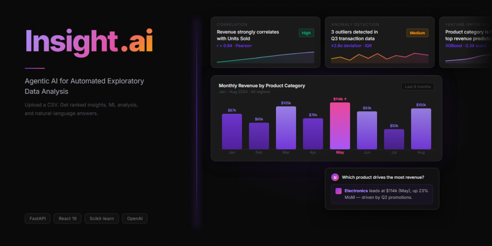
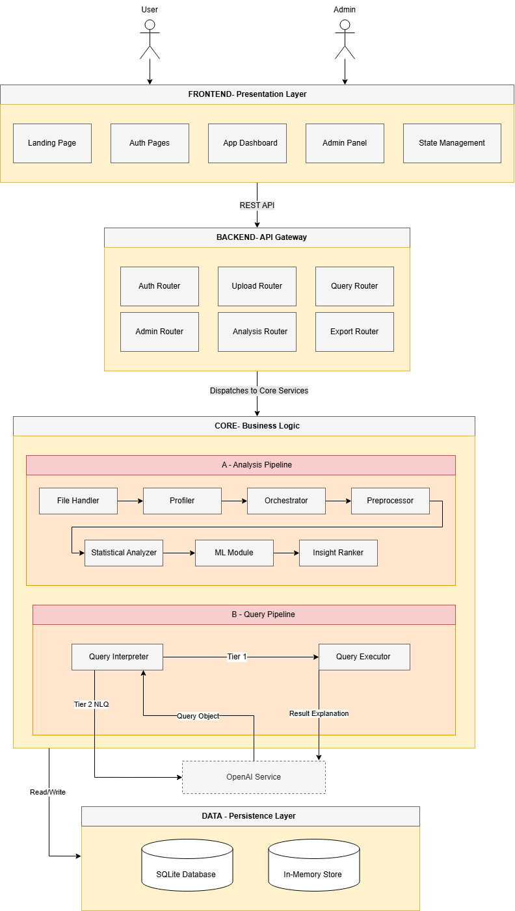

# InsightIQ — Agentic AI for Exploratory Data Analysis

<p align="center">
  
  
  
  
  
  
</p>

<p align="center">
  <strong>Upload a CSV. Get ranked insights, ML analysis, and natural-language answers — no code required.</strong>
</p>

---




---

## Table of Contents

- [Overview](#overview)
- [The Problem It Solves](#the-problem-it-solves)
- [Key Features](#key-features)
- [System Architecture](#system-architecture)
- [ML Models & Benchmarks](#ml-models--benchmarks)
- [Screenshots](#screenshots)
- [Tech Stack](#tech-stack)
- [Getting Started](#getting-started)
- [API Reference](#api-reference)
- [Demo Accounts](#demo-accounts)
- [Sample Datasets](#sample-datasets)
- [Project Structure](#project-structure)
- [Testing Results](#testing-results)
- [Limitations](#limitations)
- [Future Work](#future-work)
- [Academic Context](#academic-context)

---

## Overview

**InsightIQ** is a full-stack web platform that lets non-technical users run a complete Exploratory Data Analysis (EDA) pipeline on any CSV dataset — no Python, no SQL, no statistics background required.

Upload a file and the system autonomously:
1. Profiles every column — types, nulls, cardinality, outliers
2. Preprocesses the data — imputation, encoding, dual-tier outlier flagging
3. Runs statistical analysis — correlations, distributions, trends, group comparisons
4. Executes four benchmarked ML models based on the dataset's characteristics
5. Ranks every insight by a composite Impact × Confidence × Actionability score
6. Answers plain-English questions about the data

The core design principle is a **hybrid agentic architecture**: deterministic statistical and ML engines own all computation. LLMs are strictly confined to the explanation and conversation layer — they never touch computed values or rankings. Every result is reproducible and academically defensible.

> **SDG Alignment:** This project supports **UN SDG 4 — Quality Education** by making data analysis accessible to people without technical expertise.

---

## The Problem It Solves

| Problem | Impact |
|---|---|
| EDA tools require Python / R / SQL | Excludes students, educators, and business professionals |
| Complex interfaces create high cognitive load | Users spend effort mastering tools, not understanding data |
| LLM-only analytics tools hallucinate results | Undermines trust and academic validity |
| No transparent step-by-step reasoning | Users cannot learn from or audit the process |

InsightIQ addresses all four through a structured, explainable, agentic pipeline.

---

## Key Features

### Core Analytics Pipeline
- **Dataset Profiling** — Auto-detects column types (numeric, categorical, datetime, boolean, text), computes descriptive statistics, identifies nulls, cardinality, and IQR-based outliers
- **Preprocessing Pipeline** — Median/mode imputation, one-hot + label encoding, dual-tier outlier flagging (mild / extreme) with a full audit report — no rows are silently dropped
- **Statistical Analysis** — Group-by aggregations, distribution analysis, trend detection, Pearson/Spearman correlations, segment comparisons
- **ML Analysis** — Four benchmarked models triggered automatically by dataset characteristics (see [ML Models & Benchmarks](#ml-models--benchmarks))
- **Insight Ranking** — Composite score: Impact 50% + Confidence 35% + Actionability 15%

### Natural Language Interface
- **Two-Tier Query Pipeline**
  - **Tier 1 (Deterministic):** Rule-based intent detection + `rapidfuzz` fuzzy column matching — handles the majority of queries with zero LLM calls
  - **Tier 2 (LLM-Assisted):** GPT-4o-mini for complex or ambiguous queries — used for intent classification only, never to compute values
- **Feedback Adaptation** — Thumbs-up/down adjusts per-user column and intent matching weights over time
- **Follow-up Suggestions** — Contextual question chips generated after each answer

### Transparency & Trust
- **Preprocessing Report** — Full audit trail of every imputation, encoding, and outlier decision
- **Agentic Task Trace** — Records which pipeline steps ran and which were skipped, with reasons
- **Reliability Warnings** — Insight cards flag results when models operate outside their recommended bounds
- **Multi-format Export** — Insights as CSV, full analysis bundle as JSON, preprocessing report as plain text

### Platform
- **Session Persistence** — Analysis results cached in SQLite; fully reloadable
- **Admin Panel** — Manage users, sessions, and feedback system-wide
- **LLM-Optional** — Fully functional without an OpenAI key; Tier-2 gracefully degrades

---

## System Architecture

```
┌─────────────────────────────────────────────────────────────┐
│  PRESENTATION LAYER  (React 19 + TypeScript + TailwindCSS)  │
│  Landing · Login · Dashboard · Chat · Preview · Columns     │
└───────────────────────┬─────────────────────────────────────┘
                        │  REST API  (Axios + React Query)
┌───────────────────────▼─────────────────────────────────────┐
│  API GATEWAY  (FastAPI + Uvicorn)                            │
│  /upload · /analysis · /query · /export · /admin · /auth    │
└───────────────────────┬─────────────────────────────────────┘
                        │
┌───────────────────────▼─────────────────────────────────────┐
│  CORE PROCESSING LAYER                                       │
│  Orchestrator → Profiler → Preprocessor → StatAnalyzer      │
│              → MLModule  → InsightRanker → LLMEnhancer       │
│                                                              │
│  Query Pipeline:                                             │
│  Tier 1 — rule-based intent + rapidfuzz fuzzy matching       │
│  Tier 2 — GPT-4o-mini (complex / ambiguous queries only)     │
└───────────────────────┬─────────────────────────────────────┘
                        │
┌───────────────────────▼─────────────────────────────────────┐
│  PERSISTENCE LAYER                                           │
│  SQLite (WAL mode)  — users · auth_tokens · sessions         │
│                        feedback · query_history              │
│  In-Memory Store    — Raw / Clean DataFrames (session-scoped)│
└─────────────────────────────────────────────────────────────┘
```

<!-- 💡 SCREENSHOT INSTRUCTIONS
     Export your architecture diagram (Figure 4.1 from the report) as a PNG.
     Save it to docs/images/architecture.png, then uncomment the line below. -->
<!--  -->

**Key design decisions:**

| Decision | Rationale |
|---|---|
| Deterministic analytics engine | Reproducible, auditable results with zero hallucination risk |
| LLMs confined to explanation layer only | Prevents unreliable reasoning from influencing computed values |
| Two-tier query pipeline | Most queries resolved without any API call — faster and cost-free |
| Pydantic schemas as inter-layer contracts | Type-safe, consistent data contracts across all system layers |
| In-memory DataFrames + SQLite | Fast session operations + durable metadata across server restarts |
| Feedback-guided weight adaptation | Per-user column/intent matching improves with every interaction |

---

## ML Models & Benchmarks

Each of the four ML models was selected after benchmarking against alternatives on representative datasets. All models are triggered automatically — no user configuration needed.

### Random Forest — Classification & Feature Importance
> Triggered when a target column is identified or selected.

| Model | F1-Score | Accuracy |
|---|---|---|
| **Random Forest** | **0.8499** | **0.850** |
| XGBoost | 0.8160 | 0.816 |
| Decision Tree | 0.7958 | 0.796 |
| Logistic Regression | 0.7596 | 0.760 |

*Selected for ensemble overfitting prevention, built-in feature importance, and low hyperparameter sensitivity — critical for unknown user datasets with no manual tuning.*

---

### K-Means — Clustering & Segmentation
> Triggered when 2 or more numeric columns are present.

| Model | Silhouette Score | Inertia |
|---|---|---|
| **K-Means** | **0.7185** | **274.33** |
| Hierarchical Clustering | 0.6823 | 341.60 |
| Gaussian Mixture | 0.5822 | 853.81 |
| DBSCAN | 0.2800 | 658.39 |

*Selected for low computational cost, predictable centroid-based output, and no user-defined density parameters — suitable for fully automated pipelines.*

---

### Isolation Forest — Anomaly Detection
> Triggered when the dataset has 50 or more rows.

| Model | Precision | Recall | F1-Score |
|---|---|---|---|
| **Isolation Forest** | **0.92** | **0.92** | **0.9200** |
| Z-Score | 0.8837 | 0.76 | 0.8172 |
| LOF | 0.6250 | 1.00 | 0.7692 |
| One-Class SVM | 0.4630 | 1.00 | 0.6329 |

*Selected for being distribution-agnostic, requiring no clean training set, and offering a configurable contamination threshold — robust to irrelevant features.*

---

### Exponential Smoothing (Holt-Winters) — Forecasting
> Triggered when a datetime column and 12+ time periods are present.

| Model | RMSE | MAE |
|---|---|---|
| **Exponential Smoothing** | **4.388** | **3.485** |
| Prophet | ~6.890 | ~5.148 |
| LSTM | ~9.721 | ~7.641 |
| ARIMA | 10.978 | 8.502 |

*Selected for requiring no stationarity testing, native handling of trend and seasonality, fast training, and strong performance on the short time series typical of business CSV uploads.*

---

## Screenshots

<!-- 💡 SCREENSHOT INSTRUCTIONS
     Create a docs/images/ folder in the repo root and add each screenshot.
     Then delete the comment blocks and uncomment the image lines below.
     Suggested captures are described for each section. -->

### Dashboard — Ranked Insight Feed
<!-- Capture: The main dashboard showing ranked InsightCards, Recharts visualisations, and DatasetSummaryCard. -->
<!--  -->

### Natural Language Chat
<!-- Capture: The ChatTab with a user question, the AI-structured answer with an embedded chart, and follow-up question chips. -->
<!--  -->

### CSV Upload & Target Selection
<!-- Capture: The drag-and-drop upload area alongside the Target Column Selector modal. -->
<!--  -->

### Analysis Processing Screen
<!-- Capture: The animated processing screen showing agentic pipeline steps ticking through in real-time. -->
<!--  -->

### Column Explorer
<!-- Capture: The ColumnsTab showing per-column statistics, distribution chart, null rate, and outlier summary. -->
<!--  -->

### Dataset Preview
<!-- Capture: The PreviewTab showing the paginated data table with colour-coded clean / mild / extreme outlier rows. -->
<!--  -->

### Admin Panel
<!-- Capture: The AdminPage showing system stats, user management table, and feedback log. -->
<!--  -->

---

## Tech Stack

| Layer | Technology |
|---|---|
| Frontend | React 19, TypeScript, Vite, TailwindCSS |
| Charts & Animation | Recharts, Framer Motion |
| State & Data Fetching | Zustand, TanStack React Query, Axios |
| Backend | FastAPI, Uvicorn (ASGI), Python 3.10+ |
| Data Processing | Pandas, NumPy, SciPy, Statsmodels |
| Machine Learning | Scikit-learn |
| Fuzzy Matching | RapidFuzz |
| LLM Integration | OpenAI SDK — GPT-4o-mini (optional) |
| Data Validation | Pydantic v2 |
| Database | SQLite (WAL mode) |

---

## Getting Started

### Prerequisites

| Tool | Required Version |
|---|---|
| Python | 3.10 or higher |
| Node.js | 18 or higher |
| npm | 9 or higher |
| OpenAI API key | Optional — only needed for Tier-2 NL queries |

---

### 1 — Backend

```bash
# Clone the repo and navigate to the backend
cd insightiq

# Create and activate a virtual environment
python -m venv venv
venv\Scripts\activate        # Windows
source venv/bin/activate     # macOS / Linux

# Install dependencies
pip install -r requirements.txt
```

Create `insightiq/.env`:

```env
# Remove or leave blank to run without LLM features
OPENAI_API_KEY=sk-proj-...
LLM_ENHANCEMENT_ENABLED=true

# Pre-seeded admin credentials
ADMIN_EMAIL=admin@insightiq.com
ADMIN_PASSWORD=Admin@123
ADMIN_NAME=Admin
```

```bash
# Start the development server
uvicorn app.main:app --reload --port 8000
```

- API base URL: `http://localhost:8000`
- Interactive Swagger docs: `http://localhost:8000/docs`

---

### 2 — Frontend

```bash
cd insights-ai
npm install
npm run dev
```

- App: `http://localhost:5173`

---

### Production Build

```bash
# Frontend — output in insights-ai/dist/
cd insights-ai && npm run build

# Backend
cd insightiq
uvicorn app.main:app --host 0.0.0.0 --port 8000 --workers 2
```

---

## API Reference

All endpoints are prefixed with `/api`. Full interactive docs available at `/docs` when the server is running.

| Module | Endpoint | Method | Description |
|---|---|---|---|
| Health | `/api/health` | GET | System health check |
| Auth | `/api/auth/signup` | POST | Register a new user |
| Auth | `/api/auth/login` | POST | Login, receive bearer token |
| Auth | `/api/auth/logout` | POST | Invalidate current session token |
| Upload | `/api/upload` | POST | Upload CSV, receive DatasetProfile |
| Analysis | `/api/analysis/run/{session_id}` | POST | Trigger full analysis pipeline |
| Analysis | `/api/analysis/preprocessing-report/{session_id}` | GET | Retrieve preprocessing audit |
| Dashboard | `/api/dashboard/{session_id}` | GET | Full dashboard state |
| Dashboard | `/api/dashboard/preview/{session_id}` | GET | Paginated data preview |
| Dashboard | `/api/dashboard/column/{session_id}/{column}` | GET | Per-column statistics |
| Query | `/api/query/{session_id}` | POST | Ask a natural-language question |
| LLM | `/api/llm/status` | GET | LLM availability status |
| LLM | `/api/llm/enhance/{session_id}` | POST | Re-enhance insights with LLM |
| Export | `/api/export/{session_id}/insights.csv` | GET | Download insights as CSV |
| Export | `/api/export/{session_id}/insights.json` | GET | Download full analysis bundle |
| Export | `/api/export/{session_id}/preprocessing.txt` | GET | Download preprocessing report |
| Feedback | `/api/feedback/submit` | POST | Submit query feedback |
| Sessions | `/api/sessions/list` | GET | List current user's sessions |
| Sessions | `/api/sessions/clear/{session_id}` | DELETE | Delete a session |
| Admin | `/api/admin/stats` | GET | System-wide statistics |
| Admin | `/api/admin/users` | GET | View and manage all users |
| Admin | `/api/admin/feedback` | GET | View all feedback records |

All protected endpoints require a `Bearer <token>` header.

---

## Demo Accounts

The SQLite database ships pre-seeded — no setup needed.

| Role | Email | Password |
|---|---|---|
| Admin | `admin@insightiq.com` | `Admin@123` |
| User | `user@insightiq.com` | `User@123` |

---

## Sample Datasets

13 ready-to-use CSV files are included in `insightiq/sample_data/`:

| File | Good for testing |
|---|---|
| `sales.csv` | General EDA on a clean dataset |
| `large_sales.csv` | Performance with larger files |
| `sales_dirty_dataset.csv` | Preprocessing pipeline — missing values & outliers |
| `customers_with_missing.csv` | Missing value imputation |
| `employment_data.csv` | Categorical column analysis |
| `weather.csv` | Time-series forecasting (has datetime column) |
| `spotify_data.csv` | Multi-feature correlation analysis |
| `imdb_top_1000.csv` | Mixed numeric/categorical EDA |
| `movies.csv` | Clustering and distribution analysis |
| `Asthma dataset.csv` | Medical/health data EDA |
| `minimal.csv` | Edge-case and error-boundary testing |

---

## Project Structure

```
insightiq-fyp/
│
├── insightiq/                        # Python backend (FastAPI)
│   ├── app/
│   │   ├── api/                      # HTTP route handlers
│   │   │   ├── auth.py
│   │   │   ├── upload.py
│   │   │   ├── analysis.py
│   │   │   ├── dashboard.py
│   │   │   ├── query.py
│   │   │   ├── llm.py
│   │   │   ├── export.py
│   │   │   ├── feedback.py
│   │   │   ├── sessions.py
│   │   │   ├── admin.py
│   │   │   └── health.py
│   │   │
│   │   ├── modules/                  # Core analytical modules
│   │   │   ├── orchestrator.py       # Agentic pipeline controller
│   │   │   ├── profiler.py           # Dataset profiling
│   │   │   ├── preprocessor.py       # Data cleaning & encoding
│   │   │   ├── statistical_analysis.py
│   │   │   ├── ml_module.py          # RF · K-Means · Isolation Forest · Exp. Smoothing
│   │   │   ├── insight_ranker.py     # Composite scoring
│   │   │   ├── query_interpreter.py  # Two-tier NL query engine
│   │   │   ├── query_executor.py
│   │   │   ├── openai_planner.py     # GPT-4o-mini integration (Tier 2)
│   │   │   ├── llm_enhancer.py
│   │   │   └── exporter.py
│   │   │
│   │   ├── models/schemas.py         # 100+ Pydantic data contracts
│   │   ├── utils/                    # DB · auth · session store · feedback
│   │   └── main.py
│   │
│   ├── sample_data/                  # 13 test CSV files
│   ├── insightiq.db                  # Pre-seeded SQLite database
│   └── requirements.txt
│
└── insights-ai/                      # React frontend (TypeScript)
    ├── src/
    │   ├── api/                      # Typed API client layer
    │   ├── components/
    │   │   ├── dashboard/            # InsightFeed · ChatPanel · ChartsPanel · ...
    │   │   └── landing/              # Hero · Features · HowItWorks · ...
    │   ├── pages/
    │   │   ├── AppPage.tsx
    │   │   ├── LandingPage.tsx
    │   │   ├── LoginPage.tsx
    │   │   ├── AdminPage.tsx
    │   │   └── tabs/                 # InsightsTab · ChatTab · PreviewTab · ColumnsTab
    │   └── stores/                   # chatStore · sessionStore · toastStore
    ├── vite.config.ts
    └── tailwind.config.ts
```

---

## Testing Results

### Unit Testing — 100% Pass Rate

| Module | Test Cases | Result |
|---|---|---|
| User Registration | 10 | ✅ All Pass |
| User Login | 8 | ✅ All Pass |
| Update Profile | 8 | ✅ All Pass |
| CSV Upload Validation | Multiple | ✅ All Pass |
| Natural Language Query | Multiple | ✅ All Pass |
| Query History | Multiple | ✅ All Pass |
| Query Feedback | Multiple | ✅ All Pass |

### User Acceptance Testing (UAT)

Three non-technical participants evaluated the system across UI, functionality, and performance criteria:

| Tester | Background | Criteria Passed |
|---|---|---|
| Tester 1 | University Student | ✅ All |
| Tester 2 | Educator | ✅ All |
| Tester 3 | Business Owner | ✅ All |

UI ratings across all participants averaged 4–5 out of 5 on dashboard clarity, navigation intuitiveness, and error messaging. Post-UAT improvements included enhanced edge-case error messaging, improved small-screen responsiveness, and refined follow-up question suggestions.

---

## Limitations

| Limitation | Detail |
|---|---|
| CSV only | Max 10 MB; Excel, JSON, Parquet, and SQL not supported |
| No real-time data | Static batch uploads only — no live connectors or streaming |
| Tier-2 OpenAI dependency | Complex NL queries require an active OpenAI API key |
| SQLite concurrency | Not suitable for high-concurrency production deployments |
| Uniform explanation depth | No per-user personalisation of explanation verbosity |

---

## Future Work

1. **Multi-format ingestion** — Excel, JSON arrays, Parquet, and SQL exports
2. **Real-time connectors** — WebSocket streams, REST polling, direct database access
3. **Local LLM option** — LLaMA 3 / Mistral for offline Tier-2 processing, removing the OpenAI dependency
4. **Production database** — Migrate to PostgreSQL; add Dask or Spark for large-dataset processing
5. **Adaptive explanations** — Personalise verbosity based on detected user expertise level
6. **Extended UAT** — Broader longitudinal studies across diverse non-technical populations

---

## Academic Context

| | |
|---|---|
| **Title** | Development of a Web-Based Agentic Artificial Intelligence System with Machine Learning for Exploratory Data Analysis |
| **Author** | Dhruba Rahman (TP075774) |
| **Degree** | B.Sc. (Hons) Computer Science — Specialism in Artificial Intelligence |
| **University** | Asia Pacific University of Technology and Innovation (APU) |
| **Supervisor** | Ts. Dr. Maythem Kamal Abbas Al-Adilee |
| **Submitted** | May 2026 |
| **SDG Alignment** | SDG 4 — Quality Education |

---

<p align="center">
  <em>Making data analysis accessible to everyone — no code required.</em>
  <br><br>
  Built with FastAPI · React · Scikit-learn · OpenAI · SQLite
</p>
